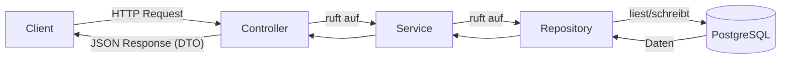
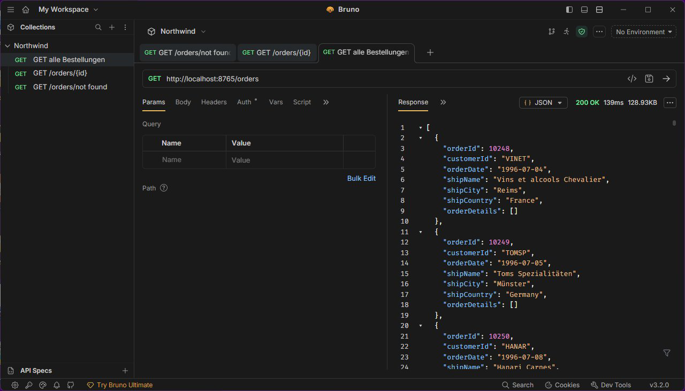
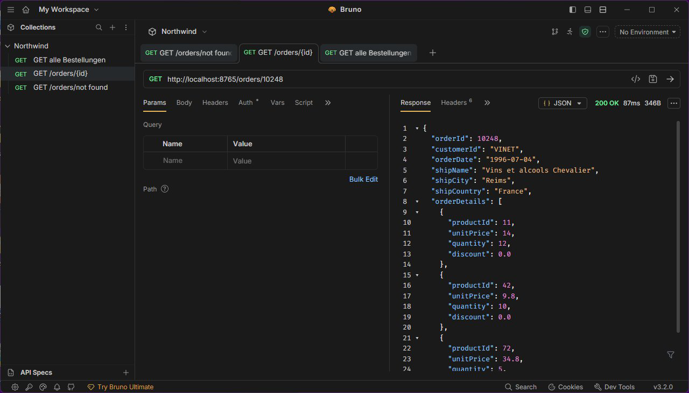
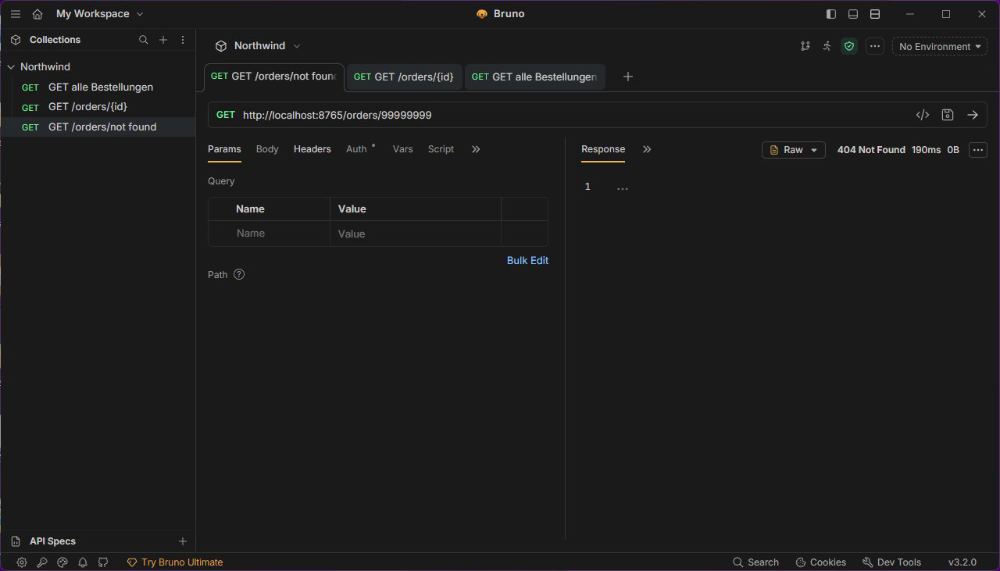

# Northwind Backend (Spring Boot)

> REST-API für die klassische **Northwind**-Datenbank – stellt Kunden, Kategorien und Bestellungen über sauber geschnittene Endpunkte bereit. Gebaut mit **Spring Boot**, **Spring Data JPA** und **PostgreSQL**.


> 🔗 Passendes Frontend: **[northwind-frontend-react](https://github.com/Giankp007/northwind-frontend-react)**

---

## 📋 Worum geht es?

Das Backend liefert die Daten der **Northwind**-Datenbank als JSON über eine REST-API. Im Mittelpunkt des Abschlussprojekts stand die **vollständige Integration der Bestellungen (Orders)** – inklusive der zusammengesetzten Bestellpositionen (`OrderDetail` mit Composite Key) und einer sauberen 404-Behandlung bei unbekannten IDs.

Die Architektur folgt durchgängig dem klassischen **Schichtenmodell**:



Entities werden dabei nie direkt nach aussen gegeben, sondern bewusst in **DTOs** (Java `record`s) gemappt.

## 🔌 API-Endpunkte

| Methode | Pfad | Beschreibung |
| --- | --- | --- |
| `GET` | `/customer` | Alle Kunden |
| `GET` | `/customer/{id}` | Einzelner Kunde (404 bei unbekannt) |
| `GET` | `/category` | Alle Kategorien |
| `GET` | `/category/{id}` | Einzelne Kategorie (404 bei unbekannt) |
| `POST` | `/category` | Neue Kategorie anlegen |
| `PUT` | `/category/{id}` | Kategorie aktualisieren |
| `GET` | `/orders` | Alle Bestellungen (ohne Positionen) |
| `GET` | `/orders/{id}` | Einzelne Bestellung **inkl. Positionen** (404 bei unbekannt) |

Server-Port: **`8765`** · CORS ist für lokale Frontend-Entwicklung offen konfiguriert.

## 🧪 API-Tests (Bruno)

Die Bestell-Endpunkte wurden mit dem API-Client **[Bruno](https://www.usebruno.com/)** verifiziert. Die vollständige Test-Dokumentation als PDF liegt unter [`docs/Bruno_Tests.pdf`](docs/Bruno_Tests.pdf).

### Test 1 – `GET /orders`
> **Status 200 OK** – JSON-Liste aller Bestellungen.



### Test 2 – `GET /orders/10248`
> **Status 200 OK** – einzelne Bestellung inklusive aller Positionen.



### Test 3 – `GET /orders/99999999`
> **Status 404 Not Found** – leerer Body, sauber abgefangen statt Serverfehler.



## 🧱 Projektstruktur

```
src/main/java/.../northwind/backend/
├── controllers/      # REST-Endpunkte (Category, Customer, Order)
├── services/         # Geschäftslogik + Entity↔DTO-Mapping
├── repositories/     # Spring-Data-JPA-Repositories
├── entities/         # JPA-Entities (inkl. OrderDetail mit Composite Key)
├── dtos/             # DTOs als Java records (Aussen-Schnittstelle)
├── configs/          # CORS-Konfiguration
└── exceptions/       # ResourceNotFoundException → 404
```

## 🚀 Lokal starten

Voraussetzungen: **JDK 21**, **Maven** und eine PostgreSQL-Datenbank mit den Northwind-Daten.

### 1. Datenbank konfigurieren

Standard-Konfiguration in `src/main/resources/application.yaml`:

```yaml
spring:
  datasource:
    url: jdbc:postgresql://localhost:5432/northwind
    username: northwind
    password: northwind
  jpa:
    hibernate:
      ddl-auto: none   # Schema wird nicht verändert, Daten kommen aus Northwind
```

> Die App erwartet ein bestehendes Northwind-Schema (`ddl-auto: none`) und ändert die Datenbank nicht.

### 2. Anwendung starten

```bash
./mvnw spring-boot:run
```

Die API ist anschliessend unter `http://localhost:8765` erreichbar.

## 🛠️ Tech-Stack

| Bereich | Technologie |
| --- | --- |
| Sprache | Java 21 |
| Framework | Spring Boot (Web MVC) |
| Persistenz | Spring Data JPA / Hibernate |
| Datenbank | PostgreSQL (Northwind) |
| Boilerplate | Lombok |
| Build | Maven |

---

*Erstellt von **Gian Kappeler** als Abschlussprojekt – Backend für Applikationen realisieren.*
