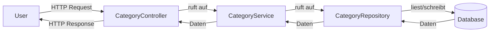

# Category — Architektur Flowchart

```mermaid
flowchart LR
    A["User"] -- "HTTP Request" --> B["CategoryController"]
    B -- "ruft auf" --> C["CategoryService"]
    C -- "ruft auf" --> D["CategoryRepository"]
    D -- "liest/schreibt" --> E[("Database")]
    E -- "Daten" --> D
    D -- "Daten" --> C
    C -- "Daten" --> B
    B -- "HTTP Response" --> A
```